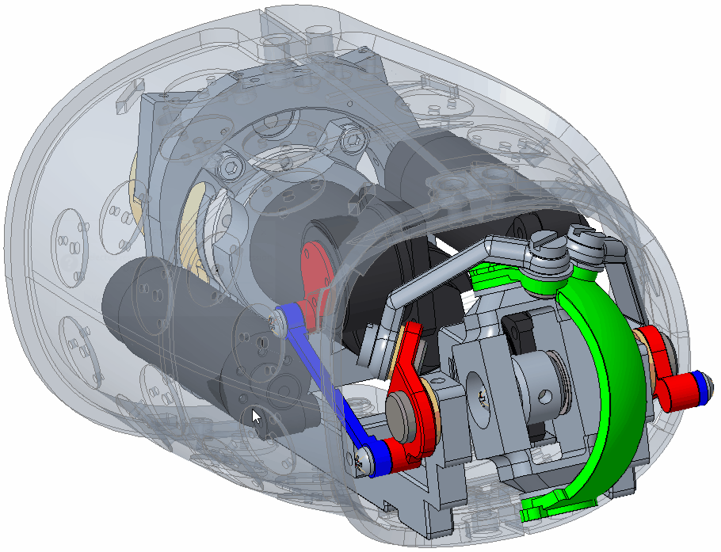

# SixBars_Mechanism_Optimization

This is the hosted code used for the evolutionary optimzation of a parallel mechanism for humanoids wrist application. 
The paper describing the mathematical approach can be found in the following link: 

[An Evolutionary Approach for the Optimal Design of the iCub mk.3 Parallel Wrist](https://www.researchgate.net/publication/328828290_An_Evolutionary_Approach_for_the_Optimal_Design_of_the_iCub_mk3_Parallel_Wrist?_sg=F0NScp3-mFuN89n5agVVzWKT0rdeRGterAEEYnv16CAgX67KeFH7g94dS4oQrIXYybYyCPxhh8xHLA.L__RNrN8yt5nkiSPKjh7KIs3BvnIhKsYuQAo84yzcz17hNp18nWL3_ROQTU1HyshxJXWlxLS0KeoFIn8uIl6yA&_sgd%5Bnc%5D=2&_sgd%5Bncwor%5D=0) 
*, IEEE-RAS 18th International Conference on Humanoid Robots (Humanoids 2018), At: Beijing, China.*

The mechanisms desrcibes a 2DoF parallel wrist consisting of six-bars linkages: 

Documentation coming soon . . .

The optimisations results led to the design of the following prototype, to be test on iCub forearm: 

