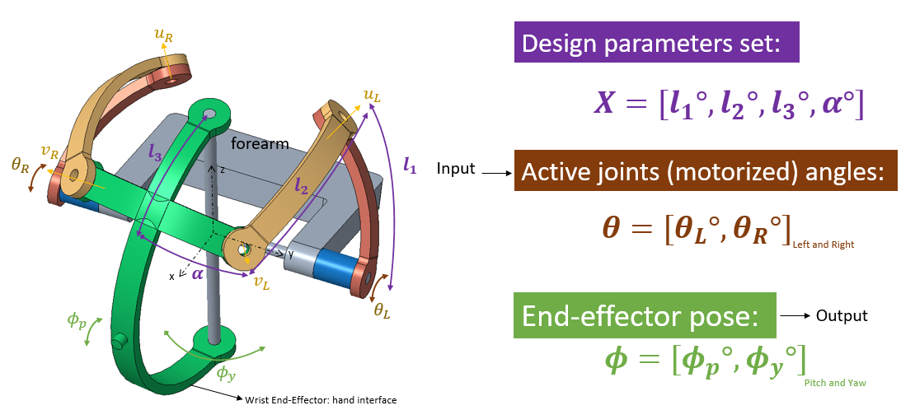
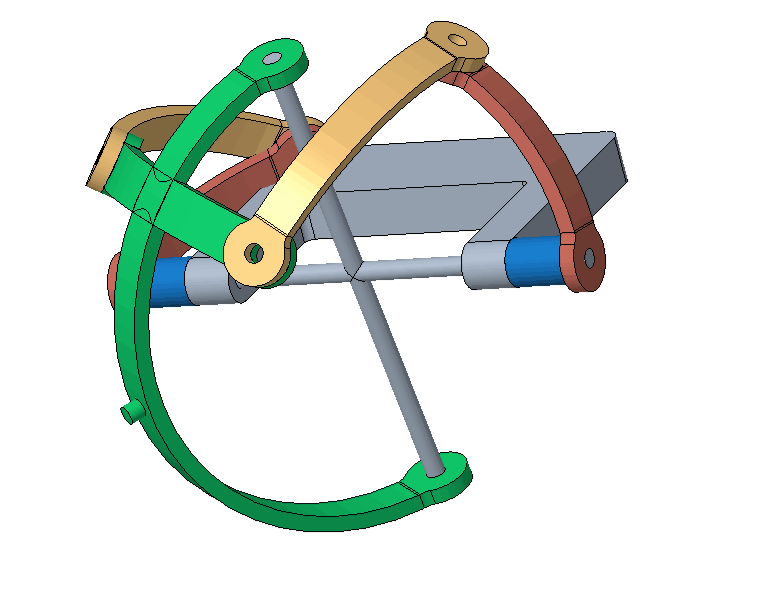
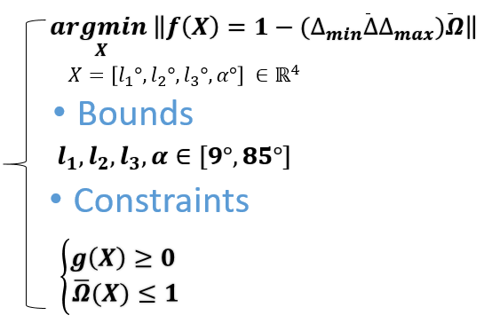
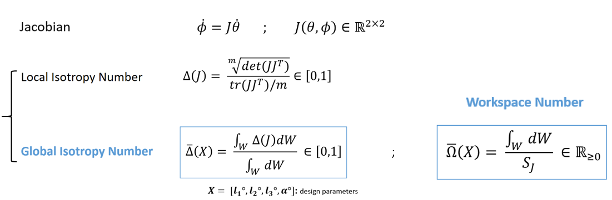
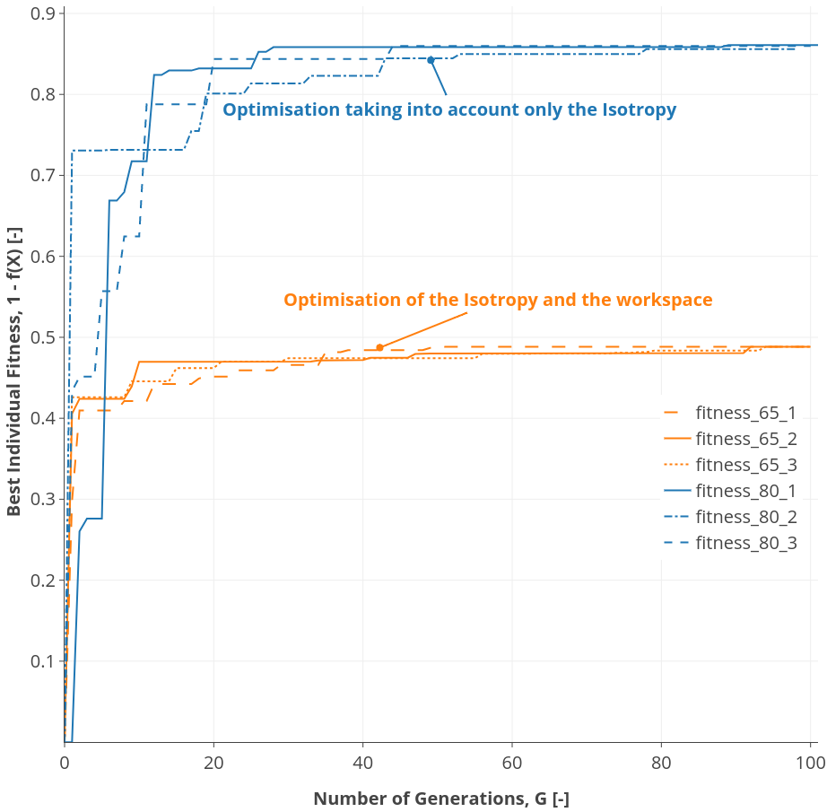
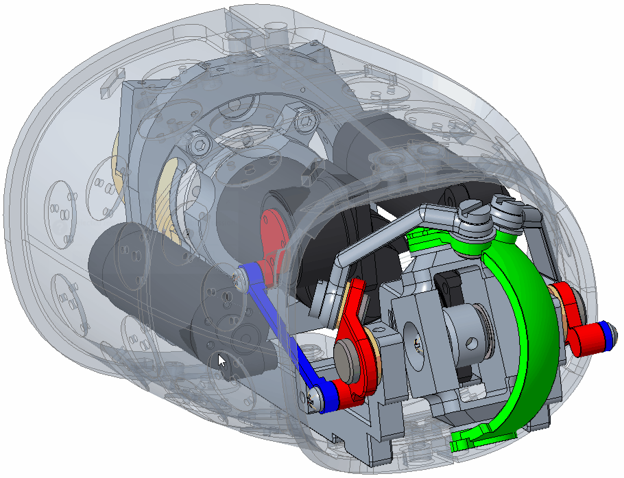

# iCub 3, SixBars_Mechanism_Optimization, Wrist

This is the hosted code used for the evolutionary optimzation of a parallel mechanism for humanoids wrist application. 
The paper describing the mathematical approach can be found in the following link: 

[An Evolutionary Approach for the Optimal Design of the iCub mk.3 Parallel Wrist](https://www.researchgate.net/publication/328828290_An_Evolutionary_Approach_for_the_Optimal_Design_of_the_iCub_mk3_Parallel_Wrist?_sg=F0NScp3-mFuN89n5agVVzWKT0rdeRGterAEEYnv16CAgX67KeFH7g94dS4oQrIXYybYyCPxhh8xHLA.L__RNrN8yt5nkiSPKjh7KIs3BvnIhKsYuQAo84yzcz17hNp18nWL3_ROQTU1HyshxJXWlxLS0KeoFIn8uIl6yA&_sgd%5Bnc%5D=2&_sgd%5Bncwor%5D=0) 
*, IEEE-RAS 18th International Conference on Humanoid Robots (Humanoids 2018), in: Beijing, China.*

The mechanism is fully defined by four design parameters:

The mechanisms desrcibes a 2DoF parallel wrist consisting of six-bars linkages: 

To optimize the mechanism uniformity and the mechanism range of motion, the following optimization problem has been designed: 

Where, the mechanism performance is defined algebrically by the next metrics, which we have introduced: 

Different optimization runs have been performed, and the optimizer converged to the same optimum in each trial: 

The optimization process took around six days to converge to the global optimum, when running the computations on a Dual AMD Opteron computer server with a @3.2 GHz processor and 64 GB RAM. 

The optimisations results led to the design of the following prototype, to be test on iCub forearm: 

One of the reasons for publishing the code is to allow users to prototype loss functions, tune the DE optimization hyperparameters, to see their effect on the convergance speed of the optimizer.  
This optimization problem could be interesting in particular for Global Optimization researchers. 

The summary of the paper could be found as a 11-slides [PowerPoint oral presentation](https://www.slideshare.net/RaedBsili/an-evolutionary-approach-for-the-optimal-design-of-the-icub-mk3-parallel-wrist), presented in the conference. 
The presentation summarizes the methodology and the algebraic model behind the posed optimization problem.  

This study was conducted as a part of the Deictic Communication (DComm) project and has received funding from
the European Union’s Horizon 2020 research and innovation programme under the Marie Skodowska-Curie Actions grant
agreement No°676063.
